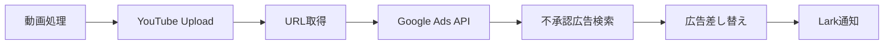

# Google Ads Auto Replacer連携ガイド

## 概要
YouTubeに動画をアップロード後、自動的にGoogle Ads Auto Replacerに動画URLを送信し、不承認広告の差し替えを実行する仕組みです。

## セットアップ手順

### 1. Google Apps Script側の設定

#### 1.1 Web Appsのデプロイ

1. Google Apps Scriptプロジェクトを開く
2. `動画URL受信API.js`を追加
3. デプロイ設定：
   - 「デプロイ」→「新しいデプロイ」
   - 種類：「ウェブアプリケーション」
   - 実行ユーザー：「自分」
   - アクセス権限：「全員」（または「全員（匿名可）」）
   - デプロイをクリック

4. 発行されたWeb App URLをコピー

#### 1.2 APIトークンの設定（オプション）

セキュリティ強化のため、認証トークンを設定：

1. GASのプロジェクト設定を開く
2. スクリプトプロパティに追加：
   ```
   キー: API_TOKEN
   値: 任意の安全なトークン文字列
   ```

### 2. Python側の設定

#### 2.1 環境変数の設定

`.env.google_ads`ファイルを編集：

```bash
# Google Apps Script Web App URL
GOOGLE_ADS_WEB_APP_URL=https://script.google.com/macros/s/YOUR_SCRIPT_ID/exec

# API認証トークン（GAS側で設定した場合）
GOOGLE_ADS_API_TOKEN=your-secure-token-here
```

#### 2.2 環境変数の読み込み

実行前に環境変数を読み込む：

```bash
# .envファイルから環境変数を読み込む
source .env.google_ads

# または、.bashrcや.zshrcに追加
export GOOGLE_ADS_WEB_APP_URL="https://script.google.com/macros/s/YOUR_SCRIPT_ID/exec"
export GOOGLE_ADS_API_TOKEN="your-secure-token-here"
```

## 使用方法

### 自動連携（推奨）

`ad_processor.py`を実行すると、以下の流れで自動処理されます：

1. Google Driveから動画を取得
2. 背景合成処理
3. YouTubeにアップロード
4. **Google Ads Auto Replacerに動画URL送信**（新機能）
5. スプレッドシートに記録

```python
from automation.ad_processor import AdProcessor

processor = AdProcessor()
processor.process_ads()  # 自動的にGoogle Ads連携も実行
```

### 手動連携

個別に動画URLを送信する場合：

```python
from automation.google_ads_connector import GoogleAdsConnector

# コネクター初期化
connector = GoogleAdsConnector()

# 動画URL送信
result = connector.send_video_url(
    video_url="https://www.youtube.com/watch?v=xxxxx",
    project_name="案件名",
    ad_name="広告名",
    video_name="動画名"  # オプション
)

if result['success']:
    print(f"成功: {result['data']}")
else:
    print(f"失敗: {result['error']}")
```

## テスト

### 接続テスト

```bash
# 接続テストを実行
python automation/google_ads_connector.py
```

### 統合テスト

```bash
# テスト用データで全体フローを確認
python test_google_ads_integration.py
```

## トラブルシューティング

### よくあるエラーと対処法

1. **「Web App URLが設定されていません」**
   - `.env.google_ads`ファイルにURLを設定
   - 環境変数を読み込み直す

2. **「認証エラー：無効なAPIトークン」**
   - GAS側とPython側で同じトークンを設定
   - トークンに特殊文字が含まれていないか確認

3. **「HTTPエラー: 403」**
   - GASのデプロイ設定でアクセス権限を確認
   - 「全員」または「全員（匿名可）」に設定

4. **「不承認広告が見つかりません」**
   - 正常な動作（該当する不承認広告がない場合）
   - プロジェクト名が正しいか確認

## データフロー



## セキュリティ考慮事項

1. **APIトークン**
   - 定期的に変更
   - 環境変数で管理（コードに直接記載しない）

2. **Web App URL**
   - URLを公開しない
   - 必要に応じてIPアドレス制限を設定

3. **ログ管理**
   - 個人情報を含むログは出力しない
   - ログファイルのアクセス権限を制限

## 関連ファイル

- `/automation/google_ads_connector.py` - Python連携モジュール
- `/google-ads-auto-replacer/動画URL受信API.js` - GAS側API
- `/automation/ad_processor.py` - メイン処理（連携機能統合済み）
- `/.env.google_ads` - 環境変数設定